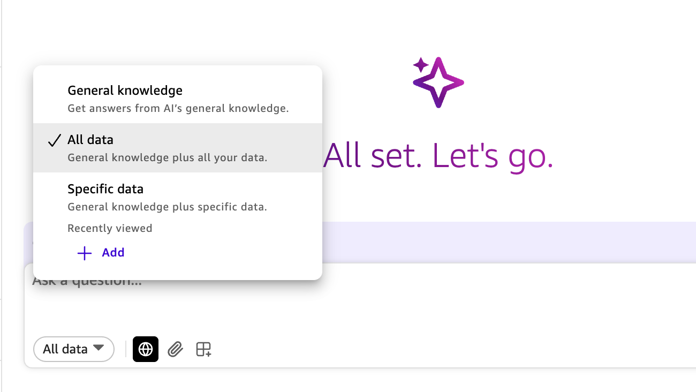

# AI 어시스턴트와 채팅하기

Riverside시 시민 서비스 디렉터로서, 모범 사례와 전략적 가이드에 빠르게 접근해야 합니다. Amazon Quick의 채팅 인터페이스는 기술적 전문성 없이도 즉각적인 AI 기반 인사이트를 제공합니다.

## 단계 1: 채팅 인터페이스 접근

1. **Amazon Quick으로 이동**: AWS 콘솔 상단 검색 바에 `Quick`을 입력하고 서비스 목록에서 **Amazon Quick**을 선택합니다. 로그인 프롬프트가 나타나면 다음 이메일을 입력하세요: `workshop-user@example.com`

2. Amazon Quick에서 채팅 패널이 아직 열리지 않았다면 우측 상단 내비게이션의 **채팅 아이콘**을 클릭합니다.

3. 기본 시스템 채팅 에이전트인 **My Assistant**가 표시됩니다.

4. 채팅 하단의 사용 가능한 옵션을 확인하고 마우스를 올려보세요:
   - **All data**: 조직의 데이터 소스, 대시보드, 통합 애플리케이션에 접근하거나 AI의 일반 지식과 직접 상호작용
   - **Web Search**: 인터넷에서 최신 정보 가져오기
   - **Attach files**: 대화에 문서를 직접 업로드
   - **Flows**: 자동화된 워크플로우 및 반복 작업 실행



## 단계 2: General Knowledge 모드 선택

1. 채팅 인터페이스에서 **All data**를 선택합니다.
2. **General knowledge** 모드를 선택합니다. 이 모드는 Quick 리소스가 아닌 기본 모델의 지식만 사용합니다.

3. 채팅 하단에서 **Web Search**가 활성화되어 있는지 확인합니다. 이를 통해 어시스턴트가 인터넷 검색 결과를 포함할 수 있습니다.

## 단계 3: 첫 번째 질문하기

채팅 인터페이스에 다음 질문을 입력하세요:

```
What are best practices for improving citizen service request response times?
```

AI 어시스턴트가 모범 사례를 기반으로 전략적 권장 사항을 제공합니다. AI가 최신 웹 콘텐츠를 포함할 수 있는 출처 인용과 함께 정보를 제공하는 것을 확인하세요. 응답 끝에 있는 **Sources** 버튼을 클릭하여 이러한 출처를 탐색할 수 있습니다.

## 단계 4: 채팅 패널 확장

대화에 집중하려면:

1. 채팅 인터페이스에서 **Expand** 버튼을 찾습니다.
2. 클릭하여 채팅 패널을 전체 너비로 확장하면 가독성이 향상됩니다.

## 단계 5: 후속 질문 시도

맥락 인식 기능을 테스트하기 위해 추가 질문을 해보세요. 채팅 에이전트의 맥락 인식이란 대화 이력과 현재 상황을 이해하고 기억하여 관련성 있고 개인화된 일관된 응답을 제공하는 것을 의미합니다.

```
How can we measure the effectiveness of these improvements?
```

```
What metrics should we track for service delivery performance?
```

AI가 이전 질문의 맥락을 유지하고 대화를 이어가는 것을 확인하세요.

> 💡 **팁**: 진행 중에 Amazon Quick My Assistant에게 도움을 요청해 보세요. 예: "What are tools in Amazon Quick used by My Assistant?"

## General Knowledge 채팅 이해하기

Quick의 General Knowledge 모드가 제공하는 것:

- **데이터 불필요**: 조직 데이터 연결 없이 인사이트 획득
- **모범 사례**: 운영, 관리 전략, 산업 표준에 대한 AI 지식 접근
- **맥락 인식**: 후속 질문이 이전 답변을 기반으로 구축
- **웹 검색**: 필요 시 인터넷에서 최신 정보 접근
- **전략적 가이드**: 고수준 전략과 모범 사례에 집중

## 핵심 요점

General Knowledge 채팅을 통해 다음이 가능합니다:

- 전략적 질문에 대한 즉각적인 답변 획득
- 여러 소스를 참조하지 않고도 모범 사례에 접근
- 구현 전 아이디어와 접근 방식 탐색
- AI 기반 가이드로 정보에 입각한 의사결정 수행

> ⚠️ 생성형 AI의 비결정적(non-deterministic) 특성으로 인해 동일한 쿼리에 대해 정확히 같은 응답을 받지 못할 수 있으나, 쿼리에 관련된 응답을 기대할 수 있습니다.

[](Lab2-document-upload-and-analysis.md)

