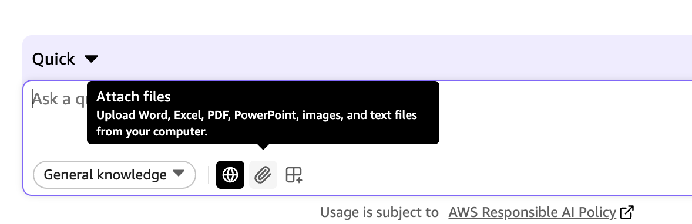
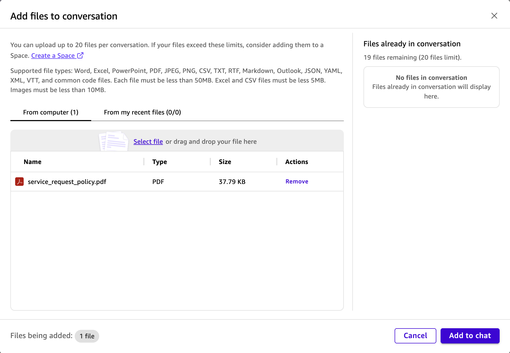

# 문서 업로드 및 분석

업데이트된 서비스 요청 정책 문서를 받았지만 전체 문서를 읽지 않고도 핵심 조항을 빠르게 이해해야 합니다. Amazon Quick의 문서 업로드 기능은 즉각적인 AI 기반 분석을 제공합니다.

## 단계 1: 정책 문서 업로드

1. 채팅 인터페이스에서 **New conversation**을 선택하여 새 대화를 시작합니다.



2. **Attach files** 아이콘을 선택합니다. 또는 파일을 대화창에 직접 드래그 앤 드롭할 수도 있습니다.

3. 워크샵 자료에서 `service_request_policy.pdf`를 선택합니다.



4. **Add to chat**을 클릭합니다.

이제 문서가 대화 내에서 분석 가능한 상태가 됩니다.

## 단계 2: 정책 관련 질문하기

파일이 업로드되면 다음 질문을 입력하세요:

```
What are the priority levels for service requests and how are they determined?
```

AI 어시스턴트가 다음을 수행합니다:

- 정책 문서에서 관련 섹션 추출
- 우선순위 수준에 대한 명확한 요약 제공
- 문서에서 정보가 나타나는 정확한 위치를 보여주는 인용 포함

> 💡 **전략적 가치**: 긴 문서를 읽지 않고도 정책 세부사항을 빠르게 이해할 수 있습니다.

## 단계 3: 서비스 표준 분석

성과 기대치에 대해 질문하세요:

```
What are the target resolution times for each service category?
```

다음을 받게 됩니다:

- 해결 시간 표준 요약
- 서비스 카테고리와 각 목표
- 예외 사항 또는 특별 조건

> 💡 **전략적 가치**: 현재 운영을 평가하기 위한 성과 벤치마크를 이해합니다.

## 단계 4: 요청 제출 채널

운영 프로세스에 대해 질문하세요:

```
What are the request submission channels available?
```

응답에는 다음이 포함됩니다:

- 요청 제출을 위한 기본 및 보조 채널
- 각 채널 접근 방법 (예: 전화, 웹 포털, 이메일)
- 요청 유형에 따라 사용할 채널

> 💡 **전략적 가치**: 시민들이 가장 적절한 채널을 활용하여 서비스 요청을 제기하는 방법을 알 수 있도록 합니다.

## 단계 5 (선택): 추가 질문 탐색

문서를 더 탐색하기 위해 다음 질문을 시도해 보세요:

```
What are the quality assurance requirements for service delivery?
```

```
How should staff handle high-priority emergency requests?
```

```
What documentation is required for each service request?
```

## 파일 업로드 기능 이해하기

Amazon Quick에서 파일 업로드의 제한사항과 기능을 이해하려면 My Assistant에게 다음 질문을 해보세요:

```
What are the limitations and capabilities when uploading files in a conversation in Amazon Quick?
```

## 핵심 요점

문서 업로드 및 분석을 통해 다음이 가능합니다:

- 긴 정책 문서에서 즉시 인사이트 추출
- 전체 문서를 읽지 않고 특정 질문하기
- 문서화된 정책을 기반으로 정보에 입각한 의사결정
- 수동 문서 검토 시간을 수 시간 절약
- 정보 수집보다 전략적 해석에 집중

이 기능은 경영진이 조직 지식과 상호작용하는 방식을 혁신하여, 정적 문서를 대화형으로 쿼리 가능한 리소스로 전환합니다.


다음 실습을 위해 **02. Spaces**로 이동해주세요.
