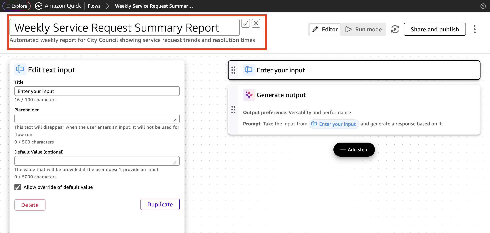
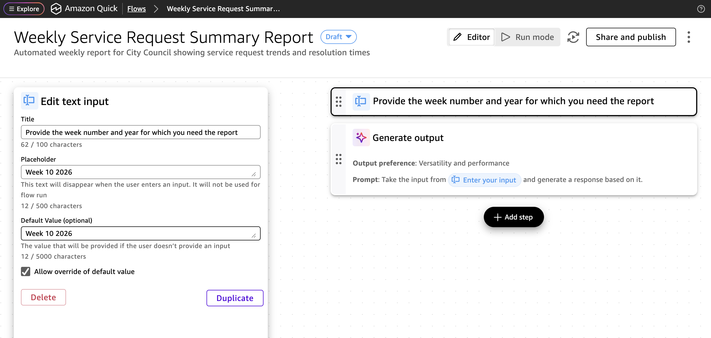
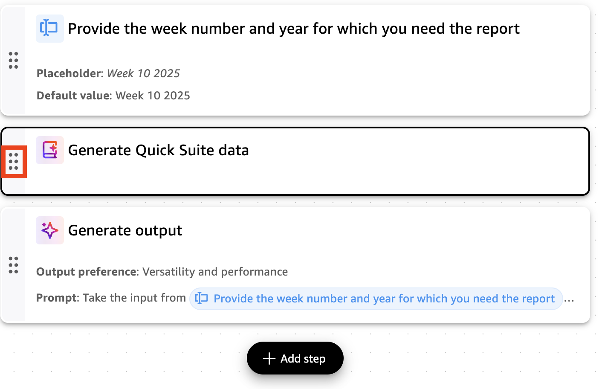
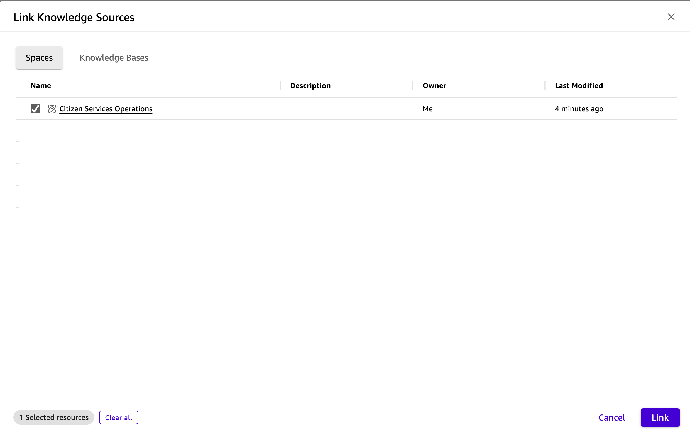
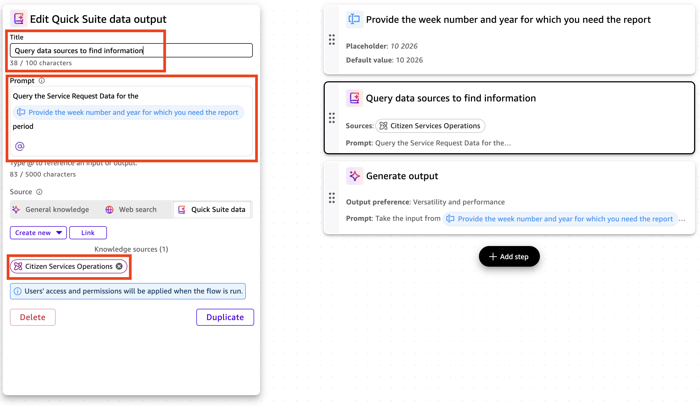
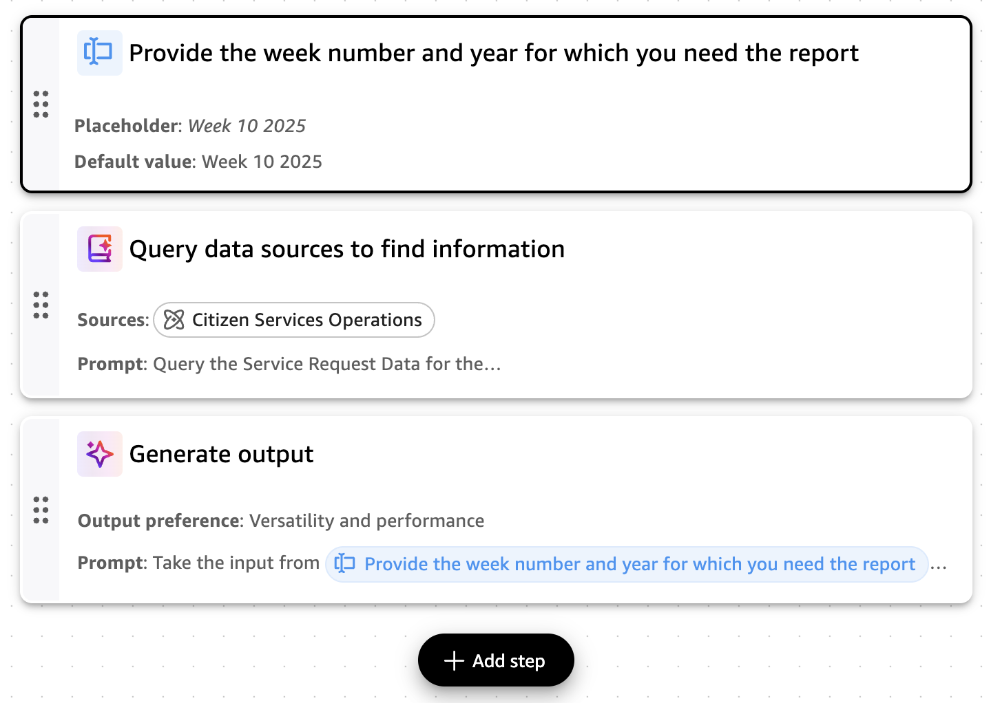
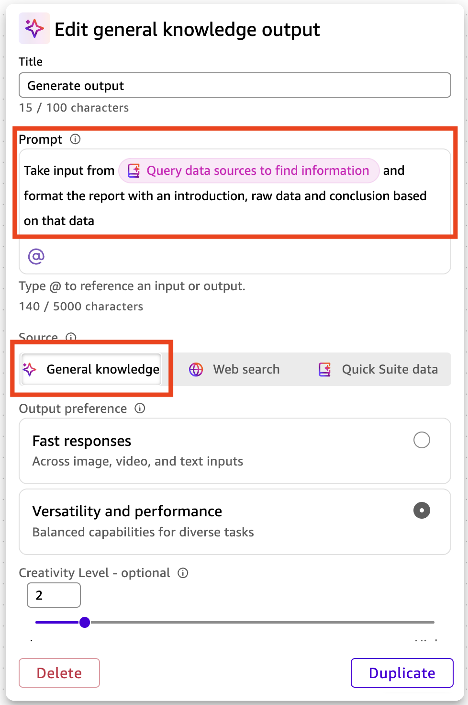
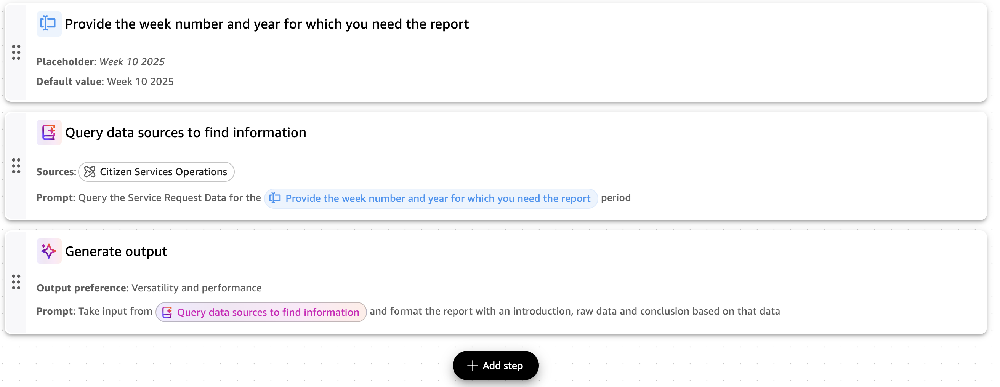

# 첫 번째 Flow 만들기

시민 서비스 디렉터로서, 시의회를 위한 주간 서비스 요청 요약 보고서를 자동화해야 합니다. Amazon Quick Flows를 사용하여 데이터를 가져오고, 트렌드를 분석하고, 인사이트를 생성하고, 전문적인 보고서를 포맷하는 워크플로우를 코드 작성 없이 만듭니다.

## 단계 1: Quick Flows 접근

1. 메인 내비게이션 바에서 **Flows**를 선택합니다.
2. Quick Flows 인터페이스에서 **Create Flow**를 선택합니다.

## 단계 2: Flow 이름 지정



1. **Create a blank flow**를 선택합니다.

2. **Flow name** 필드에 입력합니다:
   ```
   Weekly Service Request Summary Report
   ```

3. **Description** 필드에 입력합니다:
   ```
   Automated weekly report for City Council showing service request trends and resolution times
   ```

## 단계 3: Enter Input 단계 구성



1. **Enter your input** 단계를 클릭합니다.

2. **Title** 필드에 입력합니다:
   ```
   Provide the week number and year for which you need the report
   ```

3. **Placeholder**와 **Default Value** 필드에 입력합니다:
   ```
   Week 10 2025
   ```

4. 변경사항은 자동으로 저장됩니다.

## 단계 4: Data Query 단계 구성

이 단계는 지정된 기간의 서비스 요청 데이터를 쿼리합니다.

1. Flow 아래의 **Add Step** 버튼을 클릭합니다.
2. **Quick Suite data** 옵션을 선택합니다.
3. 생성된 단계를 첫 번째 단계 아래로 드래그합니다.



4. **Generate Quick Suite data** 단계를 클릭하면 왼쪽에 구성이 표시됩니다.

5. **Title** 필드에 입력합니다:
   ```
   Query data sources to find information
   ```

6. **Prompt** 필드에 입력합니다:
   ```
   Query the Service Request Data for the Provide the week number and year for which you need the report period
   ```

   > ℹ️ **참고**: "Provide the week number and year for which you need the report" 텍스트를 하이라이트하고 **@** 버튼을 클릭하여 이전 단계의 입력을 링크합니다.

7. **Link with Quick Suite Data**를 클릭한 다음 **Link**를 클릭합니다.



8. 팝업에서 **Citizen Services Operations** Space를 선택하고 **Link**를 클릭합니다.



9. 우측 패널에서 이 단계가 Flow의 2번째 단계인지 확인합니다.



## 단계 5: Output Generation 단계 수정

이 단계는 쿼리된 데이터를 전문적인 보고서로 포맷합니다.

1. **Generate output**을 클릭하여 구성을 엽니다.

2. **Prompt** 필드에 입력합니다:
   ```
   Take input from Query data sources to find information and format the report with an introduction, raw data and conclusion based on that data
   ```

   > ℹ️ **참고**: "Query data sources to find information" 텍스트를 하이라이트하고 **@** 버튼을 클릭하여 이전 단계의 입력을 링크합니다.

3. **General Knowledge**를 사용하고 소스 설정은 기본값으로 유지합니다.

각 단계는 이전 결과를 기반으로 구축되어 원시 데이터에서 포괄적인 분석을 생성합니다.



## 단계 6: 완성된 Flow 검토

완성된 Flow는 입력 → 데이터 쿼리 → 출력 생성의 흐름으로 구성되어야 합니다.



## 단계 7: Flow 실행

1. **Run mode**를 클릭하여 실행 모드로 진입합니다.
2. 주 번호와 연도를 입력합니다:
   ```
   Week 10 2025
   ```

   > ℹ️ **참고**: 데이터는 2024년과 2025년만 포함합니다.

3. **Start**를 클릭합니다.

Flow가 실행되어 주간 서비스 요청 요약 보고서를 생성합니다.

[](Lab3-trigger-your-flow.md)
